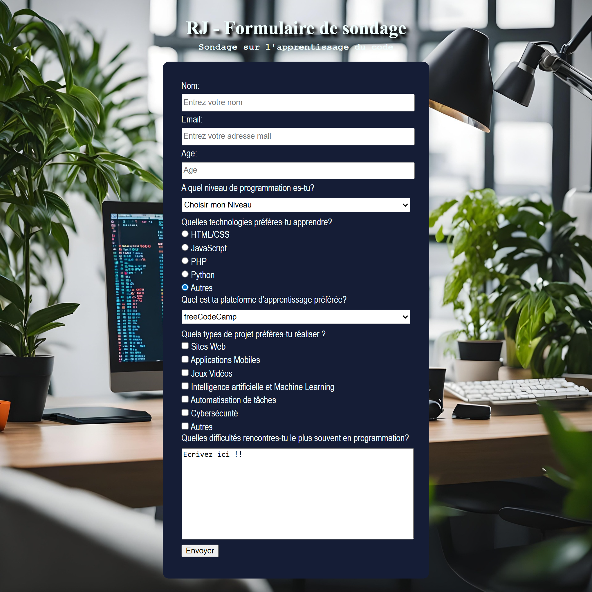

# 📋 Formulaire de Sondage

Un projet interactif réalisé dans le cadre du **certificat de design web responsive de FreeCodeCamp**.  
Ce formulaire intuitif permet aux utilisateurs de participer à un sondage avec une mise en page **responsive**, claire et accessible.

---

## 🛠️ Technologies utilisées

| Langage | Description |
|--------|-------------|
| 🔤 **HTML5** | Structure sémantique du formulaire |
| 🎨 **CSS3**  | Mise en page et style responsive |

---

## ✨ Fonctionnalités

✅ Champs de formulaire variés : texte, radio, cases à cocher, menu déroulant  
✅ Design responsive (mobile, tablette, desktop)  
✅ Style **moderne**, **simple** et **professionnel**  
✅ Accessible à tous types d’utilisateurs

---

## 🖼️ Aperçu du projet

<p align="center">
  
</p>

---

## 📁 Arborescence du projet

```bash 

formulaire-de-sondage/
├── Assets/ # Images, icônes, illustrations
├── index.html # Page principale du formulaire
├── styles.css # Feuille de style CSS
├── Output.png # Capture d’écran du rendu
├── todo.txt # Liste des tâches restantes
└── README.md # Présentation du projet

---

## ⚙️ Installation & Utilisation

1. Clone le dépôt :

```bash
git clone https://github.com/mana-rj11/formulaire-de-sondage-.git


