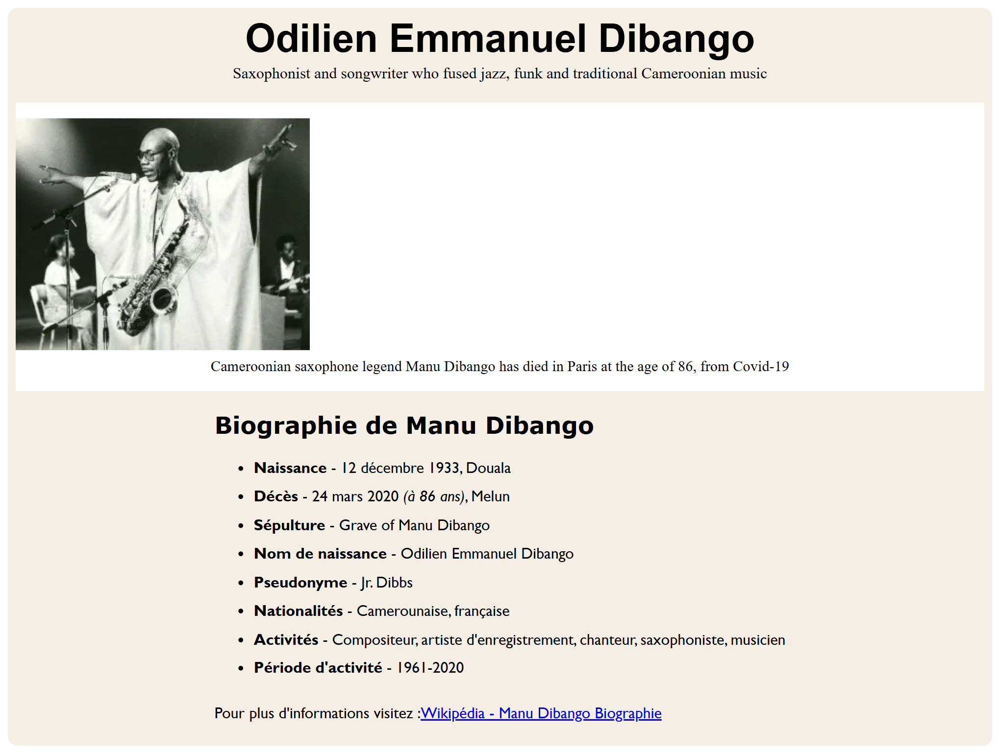

# 🎷 Page d’Hommage à Odilien Emmanuel Dibango (Manu Dibango)

Un projet de page web réalisée dans le cadre d’un exercice de **conception HTML/CSS**. Ce site rend hommage à **Manu Dibango**, saxophoniste camerounais légendaire, en présentant sa vie, ses contributions musicales et son héritage.

---

## 🧰 Technologies utilisées

- **HTML5** – Structure sémantique du contenu
- **CSS3** – Mise en page élégante et responsive

---

## 💡 Fonctionnalités

✅ Présentation claire et esthétique d’une figure historique  
✅ Mise en page responsive, compatible tous écrans  
✅ Image, biographie, faits marquants et liens externes  
✅ Design sobre et lisible, avec accent sur la typographie

---

## 🖼️ Aperçu du Projet

---

## 📜 Contenu de la biographie

La page inclut :
- Les informations essentielles sur la vie de **Manu Dibango**
- Une **photo emblématique**
- Une section **biographie** structurée : naissance, carrière, décès, nationalité, etc.
- Un lien vers la [biographie Wikipédia](https://fr.wikipedia.org/wiki/Manu_Dibango)

---
